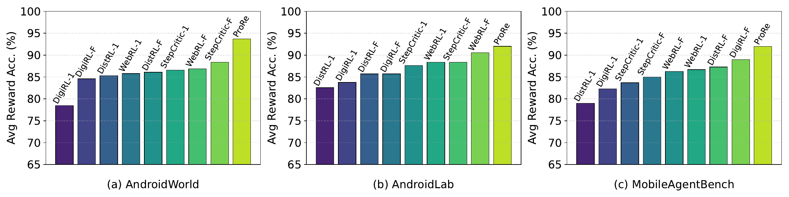
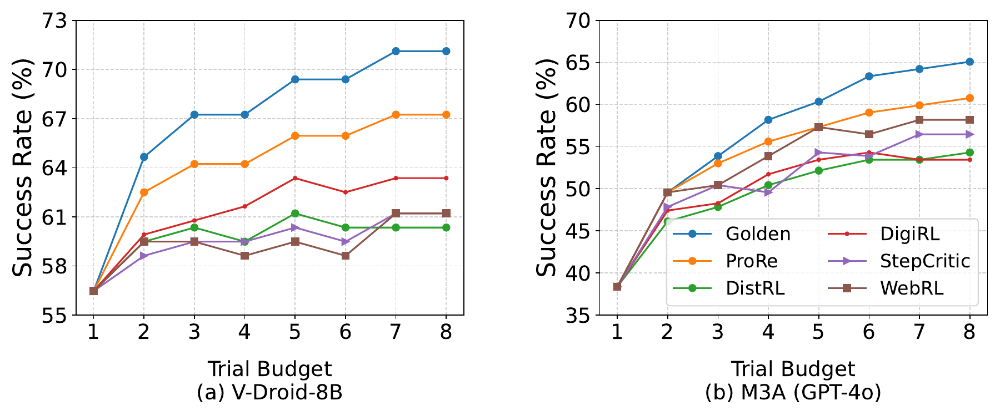

# ProRe: A Proactive Reward System for GUI Agents via Reasoner-Actor Collaboration

This repo provides the public release for ProRe, our proactive reward system for GUI agents. ProRe improves reward assignment by going beyond static trajectory judging: a general-purpose reasoner proposes targeted probing tasks, and a domain-specific evaluator agent interacts with the environment to collect additional evidence before the final reward decision.

Unlike rule-based verification, ProRe does not require handwritten task-specific testing logic. Unlike trajectory-only LLM-as-a-Judge approaches, ProRe does not rely only on the original screenshots or logs produced by the policy agent. Instead, it actively probes the environment for missing evidence and then performs high-level judgment over both the original execution trace and the probed states.

ProRe is based on our ICLR 2026 paper:

- Paper: `ProRe: A Proactive Reward System for GUI Agents via Reasoner-Actor Collaboration`


ProRe improves reward accuracy and F1 across several GUI-agent benchmarks, and also improves downstream policy-agent success rate when used for test-time scaling.

## Example

A simple example from the paper is the task:

`Take two photos`

If we only look at the original task trajectory, the final screenshots may not provide enough evidence to reliably determine whether two photos were actually captured. A static judge may only see that the camera app was opened and that at least one photo was taken.

With ProRe, the reasoner generates a probing task such as:

`Retrieve the newly taken photos`

The evaluator agent then executes this probing task in the live environment and checks the gallery or related UI states for direct evidence. The final reward is assigned based on both:

- what the policy agent did during the original task
- what the evaluator agent observed during probing

This is the core idea behind ProRe: use additional targeted interaction to make reward decisions more grounded and more verifiable.

## ProRe Workflow

In ProRe, reward assignment follows a reasoner-actor collaboration workflow:


1. A policy agent executes the original GUI task.
2. A reasoner generates a probing task that can reveal key evidence about task completion.
3. An evaluator agent executes the probing task in the environment.
4. The reasoner compares the original task trajectory and the evaluator's probed observations.
5. ProRe returns the final reward judgment.

This design makes reward evaluation more verifiable, more robust to incomplete observations, and easier to scale than manual verification code.

## Code Structure

- `run_suite.py`
  Main entry point for launching evaluation.
- `main.sh`
  Example script for running tasks.
- `android_world/agents/vdroid.py`
  Implementation of the main task-execution agent.
- `android_world/agents/evaluator.py`
  Implementation of the ProRe evaluator/probing agent.
- `android_world/suite_utils.py`
  Task loop and execute-then-judge pipeline.
- `evaluation_task.py`
  Probing-task generation from the original task goal.
- `Figure/`
  Figures from the paper.
- `datasets/`
  Example data files.

## Quick Start

1. Setup the AndroidWorld environment.
2. Launch the Android emulator with gRPC enabled.
3. Install dependencies.
4. Configure model-provider environment variables if needed.
5. Run evaluation with ProRe enabled.

Example:

```bash
bash main.sh
```

Or run directly:

```bash
python run_suite.py \
  --tasks="CameraTakePhoto" \
  --agent_name="VDroid" \
  --probing_agent_name="ProRe" \
  --execute_then_judge=True
```

## Environment Setup

We recommend using Python 3.11 or above.

Install dependencies:

```bash
pip install -r requirements.txt
```

Several model backends read credentials from environment variables. The code supports multiple providers depending on your setup.

```bash
# Gemini / GCP
export GCP_API_KEY=

# OpenAI-compatible APIs
export OPENAI_ENDPOINT=
export OPENAI_MODEL_NAME=
export OPENAI_API_VERSION=
export OPENAI_API_KEY=

# Azure OpenAI
export AZURE_OPENAI_API_KEY=
export AZURE_OPENAI_MODEL_NAME=
export AZURE_OPENAI_API_VERSION=
export AZURE_OPENAI_ENDPOINT=
```

These backends are mainly used for reasoning, probing-goal generation, and related evaluation components.

## Public Release Notes

In this public version:

- both the main agent and the probing agent are initialized in `run_suite.py`
- the probing agent is passed into the task runner and reconfigured per task
- `execute_then_judge=True` enables the ProRe reward pipeline

This layout is intended to make the reward flow easier for new readers to follow.

## Results

Instead of relying on a stronger static judge alone, ProRe improves reward quality through proactive evidence collection. The benchmark results and test-time scaling gains are illustrated below.





## Citation

If you use this repo, please cite our paper:

```bibtex
@inproceedings{dai2026prore,
  title={ProRe: A Proactive Reward System for GUI Agents via Reasoner-Actor Collaboration},
  author={Dai, Gaole and Jiang, Shiqi and Li, Yuanchun and Cao, Ting and Li, Mo and Tan, Rui and Yang, Yuqing and Qiu, Lili},
  booktitle={International Conference on Learning Representations},
  year={2026}
}
```
