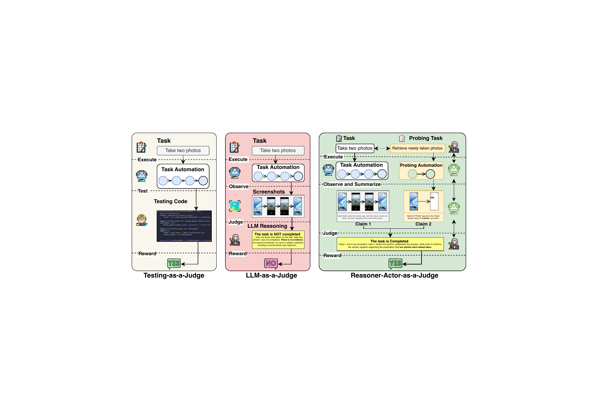
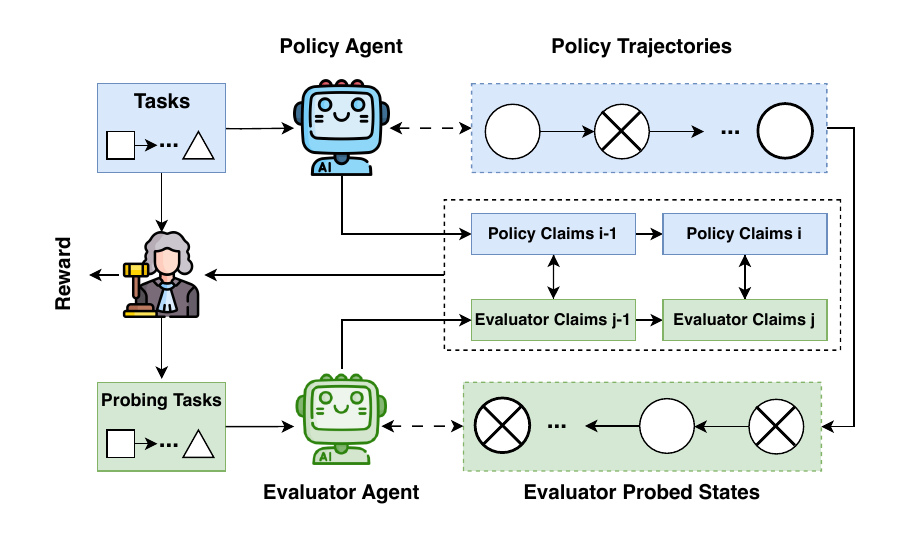

# ProRe

ProRe is a proactive reward system for GUI agents. Instead of judging a task only from the policy agent's static trajectory, ProRe lets a reasoner plan targeted probing tasks and then uses an evaluator agent to interact with the environment, collect extra evidence, and support a more reliable final reward decision.

This repository is based on our ICLR 2026 paper:

> ProRe: A Proactive Reward System for GUI Agents via Reasoner-Actor Collaboration



## Why ProRe?

Rewarding GUI agents is difficult because task completion is often not fully observable from the original execution trace alone.

- Rule-based rewards are accurate, but expensive to scale because they require handwritten verification logic for each task.
- Trajectory-only LLM-as-a-Judge is scalable, but often misses crucial state evidence when screenshots or logs are incomplete.
- GUI evaluation also requires domain-specific interaction skills that general-purpose LLMs do not always have.

ProRe addresses this by moving from passive judgment to proactive probing.

## Core Idea

ProRe separates the reward process into two roles:

- `Reasoner`: a general-purpose model that plans what evidence is needed and performs the final high-level judgment.
- `Evaluator Agent`: a domain-specific GUI agent that actively probes the environment to gather the missing evidence.

The workflow is:

1. A policy agent executes the original task.
2. The reasoner generates a probing task that would help verify success.
3. The evaluator agent executes that probing task in the live environment.
4. The reasoner judges success by comparing the original trajectory and the probed evidence.

This makes the reward signal more verifiable, more accurate, and more useful for training or test-time scaling.

## Framework



At a high level, ProRe uses reasoner-actor collaboration:

- The policy agent produces a trajectory for the original task.
- The reasoner proposes probing tasks that expose the evidence needed for verification.
- The evaluator agent executes those probing tasks and observes the resulting GUI states.
- The reasoner performs the final reward decision over structured claims from both sides.

## What Is In This Repo

- `run_suite.py`: main entry point for running evaluation.
- `main.sh`: example launch script.
- `android_world/agents/vdroid.py`: implementation of the main task-execution agent.
- `android_world/agents/evaluator.py`: implementation of the ProRe evaluator/probing agent.
- `android_world/suite_utils.py`: suite runner and execute-then-judge pipeline.
- `evaluation_task.py`: probing-task generation from the original task goal.
- `Figure/`: figures from the paper.
- `datasets/`: example data files.

## Repository Flow

In the public version of this codebase, the main agent and the probing agent are both initialized in `run_suite.py`.

When `execute_then_judge=True`:

1. The main agent first executes the task.
2. A probing goal is generated from the original task.
3. The probing agent is reconfigured for the current task.
4. The probing agent collects additional GUI evidence.
5. ProRe returns the final reward judgment.

This setup is meant to make the overall reward pipeline easy to follow for new readers.

## Quick Start

Run the example script:

```bash
bash main.sh
```

Or run directly:

```bash
python run_suite.py \
  --tasks="CameraTakePhoto" \
  --agent_name="VDroid" \
  --probing_agent_name="ProRe" \
  --execute_then_judge=True
```

## Main Components

### 1. Policy Agent

The policy agent is responsible for performing the original GUI task.

In this repository, `VDroid` is the primary execution agent exposed in the public configuration.

### 2. Probing Goal Generation

`evaluation_task.py` generates a short probing goal from the original task. The probing goal is not a repeat of the original task. Instead, it asks for the key evidence needed to verify whether the original task was completed.

### 3. Evaluator Agent

The evaluator agent lives in `android_world/agents/evaluator.py`. It executes probing tasks in the environment, gathers additional observations, and prepares evidence for the final judgment.

### 4. Final Reward Decision

The final reward is not based only on the original trace. It also considers what the evaluator agent discovered during probing. This is the core difference between ProRe and trajectory-only judging.

## Results From The Paper

Across more than 3K trajectories from AndroidWorld, AndroidLab, and MobileAgentBench, the paper shows that ProRe:

- improves reward accuracy by up to 5.3%
- improves F1 by up to 19.4%
- reaches 93.7% average reward accuracy
- improves policy-agent success rate by up to 22.4% when used for test-time scaling

These gains come from collecting better verification evidence rather than only using a stronger static judge.

## Figures

The repository includes several figures from the paper in `Figure/`.

- `Figure/key_idea.pdf`: high-level intuition of ProRe
- `Figure/framework.pdf`: framework overview
- `Figure/combined_benchmarks.pdf`: benchmark results
- `Figure/test_time_scaling_combined.pdf`: test-time scaling results

For GitHub-friendly rendering, PNG copies of the main conceptual figures are stored in `Figure/png/`.

## Environment Notes

- This code assumes external Android emulator and model-serving infrastructure are already available.
- Several model backends read credentials from environment variables such as `OPENAI_API_KEY`, `AZURE_OPENAI_API_KEY`, `GEMINI_KEY`, and related endpoint settings.
- The public configuration currently exposes `ProRe` as the probing/evaluation agent.

## Citation

If you use this code or build on this project, please cite:

```bibtex
@article{dai2025prore,
  title={ProRe: A Proactive Reward System for GUI Agents via Reasoner-Actor Collaboration},
  author={Dai, Gaole and Jiang, Shiqi and Cao, Ting and Yang, Yuqing and Li, Yuanchun and Tan, Rui and Li, Mo and Qiu, Lili},
  journal={arXiv preprint arXiv:2509.21823},
  year={2025}
}
```

## Acknowledgment

This open-source release is adapted from our research codebase for clearer public reading and reuse.
